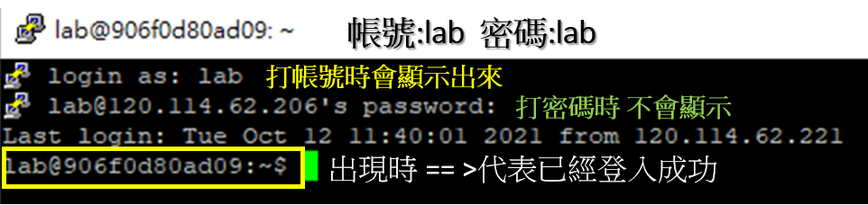
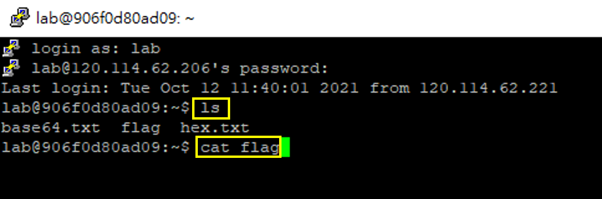
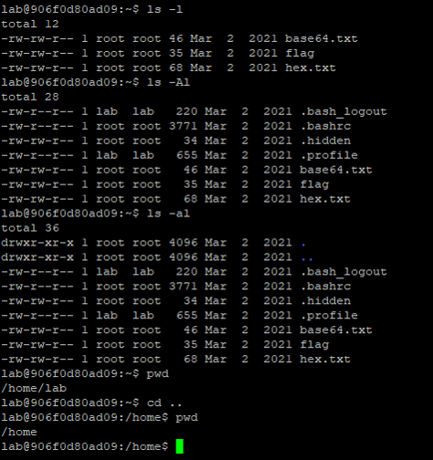
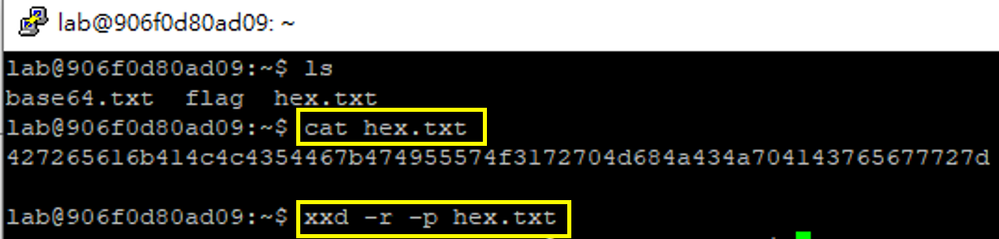
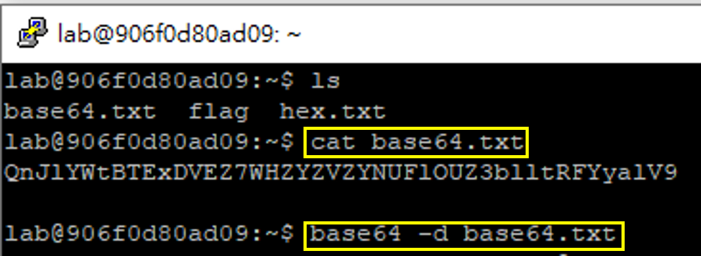
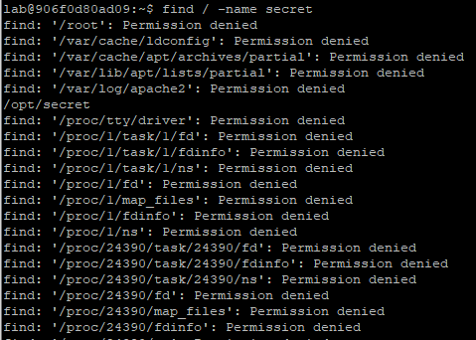

# MyFIRSTSecurity2021
```
Part 1.資安起手式 ==========================> (必教)
Part 2.網站安全(WEB SECURITY)  =============> (第三選擇)
Part 3.編碼與解碼 ==========================> (必教)
Part 4.古典密碼與破密分析       =============> (第二選擇)
Part 5.認識linux 與基礎指令介紹 =============> (第一選擇)
```


# Part 1.資安起手式

## 學習資安技能的超趣活動--CTF搶旗大賽解題實戰
| 影片主題 |  YOUTUBE網址  |
|-----| -------|
|開場白  | https://youtu.be/JCKYH6VXZaY  |

## 註冊與登入CTF
| 影片主題 |  YOUTUBE網址  |
|-----| -------|
| 註冊與登入CTF | https://youtu.be/k12jmUEHsrY  |

## 起手式---word隱寫術
| 影片主題 |  YOUTUBE網址  |
|-----| -------|
| 文件隱寫術(word隱寫術) | https://youtu.be/5ld5X4Kh8hI  |
|(*)圖片隱寫術(本題在LINUX下解) |   |

# Part 2.網站安全 WEB SECURITY
## (*)Hitcon CTF 實境秀實體課程才有
- (*)[台灣舉辦的世界級搶旗大賽Hitcon CTF](https://ctf2017.hitcon.org/) 

## 超簡單的網站安全

| 影片主題 |  YOUTUBE網址  |
|-----| -------|
|Web-1:source code  | https://youtu.be/EaqhDyEMRKc  |
|web-2:Easy_Robots.txt  | https://youtu.be/88nYZwJJ5CI  |
|web-3:Robots.txt (本題用來引導學生學習編碼與解碼) | https://youtu.be/N_TqKJj9YZg  |
|web-3:Robots.txt (解答) | https://youtu.be/wkfBePek-NE  |

# Part 3.編碼與解碼
## 編碼與解碼
| 影片主題 |  YOUTUBE網址  |
|-----| -------|
| ASCII 編碼 與解碼(一定要上) | https://youtu.be/TnbEAXfWMq4  |

### 時間充足下可講解基本原理
| 影片主題 |  YOUTUBE網址  |
|-----| -------|
| BASE64 編碼 與解碼 原理 (有時間再講)| https://youtu.be/pIYU3qnn9bU  |
| Morse Code編碼 與解碼 原理 (有時間再講) | https://youtu.be/Mfctk2o3hSo  |
- [ASCII 編碼 與解碼(WIKI說明)](https://zh.wikipedia.org/wiki/ASCII)
- [BASE64 編碼 與解碼(WIKI說明)](https://zh.wikipedia.org/wiki/Base64)
- [摩斯電碼Morse code中文wiki說明](https://zh.wikipedia.org/wiki/%E6%91%A9%E5%B0%94%E6%96%AF%E7%94%B5%E7%A0%81)
- [摩斯電碼Morse code英文wiki說明](https://en.wikipedia.org/wiki/Morse_code)
- [HOW IT WORKS: Morse Code](https://www.youtube.com/watch?v=xsDk5_bktFo)
- base32的原理請留給學生上網自主學習 ==> 請勿幫學生寫作業{重點不是解答,而是要學生養成自己學習能力}

# Part 4.古典密碼與破密分析

## 古典密碼之破密分析
| 影片主題 |  YOUTUBE網址  |
|-----| -------|
| 凱撒密碼與暴力破解法(ABCTF 2016 : ceasar-salad-10)| https://youtu.be/Fh2G9-bqdrE  |

- [凱撒密碼Caesar cipher](https://zh.wikipedia.org/wiki/%E5%87%B1%E6%92%92%E5%AF%86%E7%A2%BC)
- 教導基本觀念:`明`文(`plain`text)與`密`文(`cyber`text), 加密(`En`cryption)與解密(`De`cryption)
- [ROT13:特殊變型的凱撒密碼](https://zh.wikipedia.org/wiki/ROT13)

#### 時間充足下,可教導下列主題

| 影片主題 |  YOUTUBE網址  |
|-----| -------|
| 頻率分析法(Pico CTF 2014 : Substitution)| https://youtu.be/AO6MniwhpwQ  |
| 密碼棒(EKOPARTY CTF 2015: SCYTCRYPTO) | https://youtu.be/e9OxaEjsoVs  |

- [頻率分析法](https://zh.wikipedia.org/wiki/%E9%A2%91%E7%8E%87%E5%88%86%E6%9E%90)
- [頻率分析法線上工具(題目也有連結)](https://quipqiup.com/)
- [密碼棒Scytale](https://zh.wikipedia.org/wiki/%E5%AF%86%E7%A2%BC%E6%A3%92)

# Part 5.認識linux 與基礎指令介紹
## 下載putty

- 使用putty 登入時的畫面
- 


## linux 基礎指令與簡易安全觀念[錄影教學]
| 影片主題 |  YOUTUBE網址  |
|-----| -------|
| 認識linux作業系統 |  請簡單說即可[參考資料](https://github.com/MyFirstSecurity2020/HappyLinuxDay/blob/main/1.linux%E5%9F%BA%E7%A4%8E%E5%85%A5%E9%96%80/1_1_%E8%AA%8D%E8%AD%98linux.md) |
| 使用putty安全連線到遠方伺服器與Linux-1|https://youtu.be/4UQG_AUEid4 |
| Linux-2 | https://youtu.be/rqLK39E_380  |

| 影片主題 |  YOUTUBE網址  |
|-----| -------|
| Linux-3 | https://youtu.be/L9PEB_4ATYI  |
| Linux-4 | https://youtu.be/jn3AihYJF7c  |
| Linux-5| https://youtu.be/0sL5roF04pI  |

## linux 基礎指令與簡易安全觀念[關鍵過程]

### linux-1:指令


- 解答
  - ls 
  - cat flag

### linux-2:指令參數的用法

- 解答
  - ls -Al
  - cat .hidden
   
- 說明清楚底下指令參數的結果
  - ls -l
  - ls -A
  - ls -a
  - ls -Al 



### linux-3:16進位轉字串(hex to string) ==>就是ascii編碼==> LINUX指令:xxd




### linux-4:base64 解碼==> LINUX指令: base64



### linux-5:找尋檔案的LINUX指令:find



.png)


