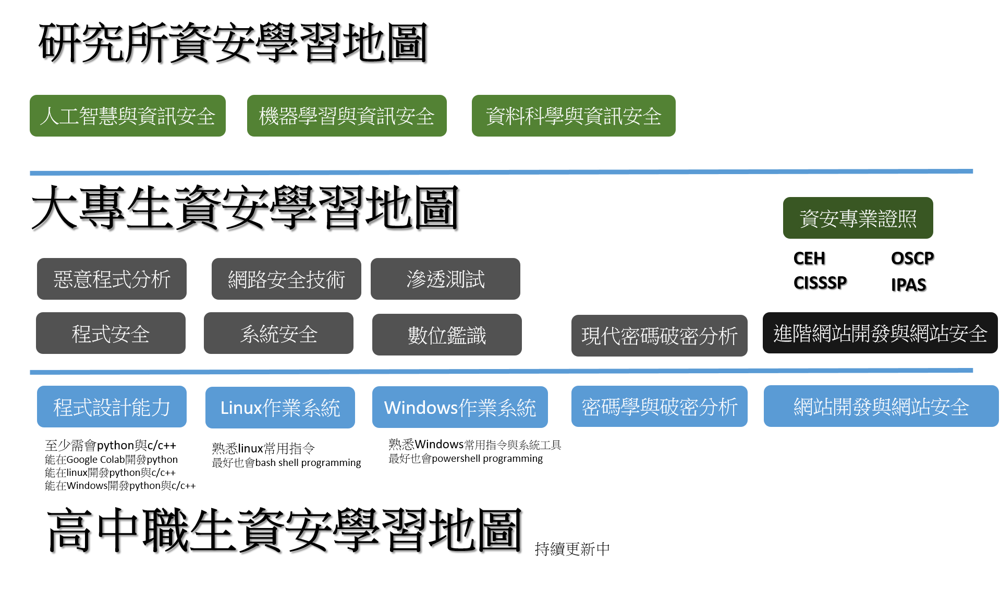

# HighSchoolSecurity

本網站是由Mydeargreatteacher維護

## Mydeargreatteacher == 我親愛的偉大恩師 龍大大

## 學資安 ==> 很貴的

- [HITCON Training 2021](https://hitcon.kktix.cc/events/hitcon-training-2021)
- [BlackHat Training](https://www.blackhat.com/tr-22/training/schedule/index.html)

## 打CTF 學資安 >> 蓋高尚 !有水準 ! High class!

## 學資安 就要考資安專業證照
- [IPAS|資訊安全工程師---入門級|讓你建立信心用](https://www.ipas.org.tw/?AspxAutoDetectCookieSupport=1)
- [CISSP|CISSP資安系統專家](https://www.uuu.com.tw/Course/Show/47/CISSP-%E8%B3%87%E5%AE%89%E7%B3%BB%E7%B5%B1%E5%B0%88%E5%AE%B6%E8%AA%8D%E8%AD%89%E8%AA%B2%E7%A8%8B)
- [CEH|EC-Council CEH駭客技術專家](https://www.uuu.com.tw/Course/Show/300/EC-Council-CEH-%E9%A7%AD%E5%AE%A2%E6%8A%80%E8%A1%93%E5%B0%88%E5%AE%B6%E8%AA%8D%E8%AD%89%E8%AA%B2%E7%A8%8B)
- [OSCP](https://www.offensive-security.com/pwk-oscp/)  [中華資安課程](https://www.chtsecurity.com/service/m404)
- [CompTIA Security＋](https://www.uuu.com.tw/Course/Show/1607/CompTIA-Security-%E5%9C%8B%E9%9A%9B%E8%B3%87%E8%A8%8A%E5%AE%89%E5%85%A8%E5%B0%88%E5%AE%B6%E8%AA%8D%E8%AD%89%E8%AA%B2%E7%A8%8B)

## [104資安職缺](https://www.104.com.tw/jobs/search/?ro=0&kwop=7&keyword=%E8%B3%87%E5%AE%89&expansionType=area%2Cspec%2Ccom%2Cjob%2Cwf%2Cwktm&order=12&asc=0&page=2&mode=s&jobsource=2018indexpoc&langFlag=0&langStatus=0)

## 資訊安全學習地圖

